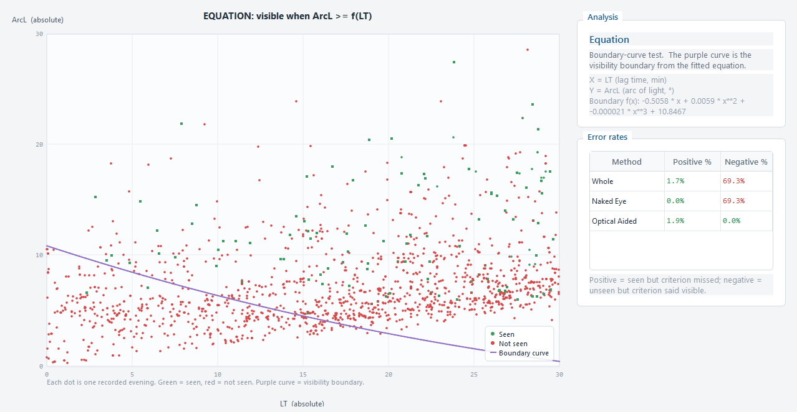
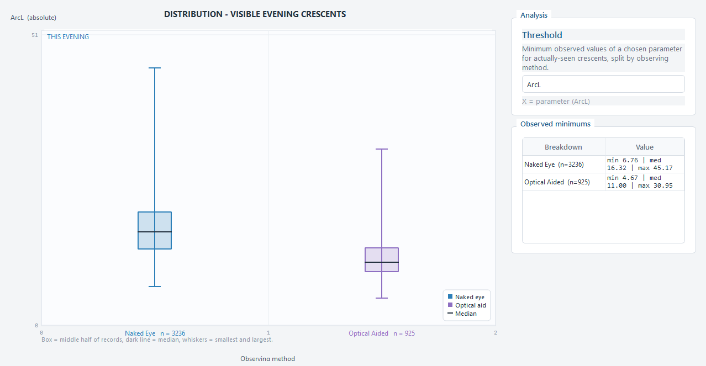
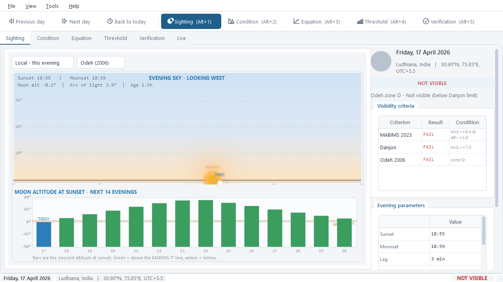
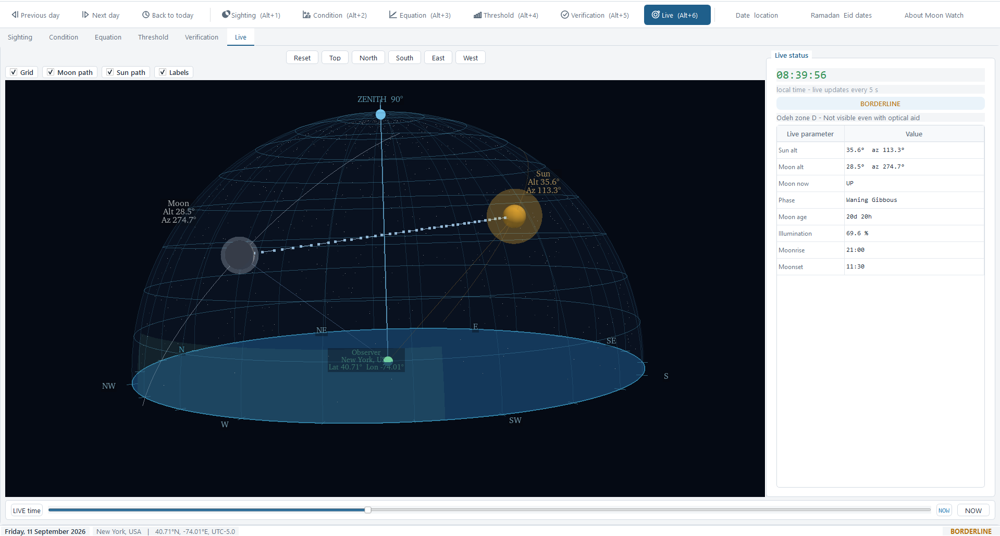
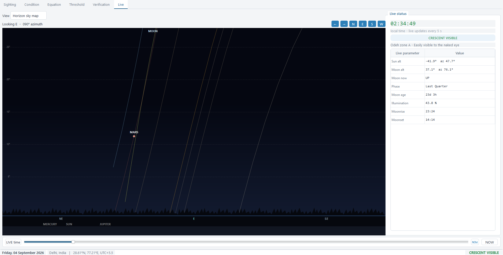
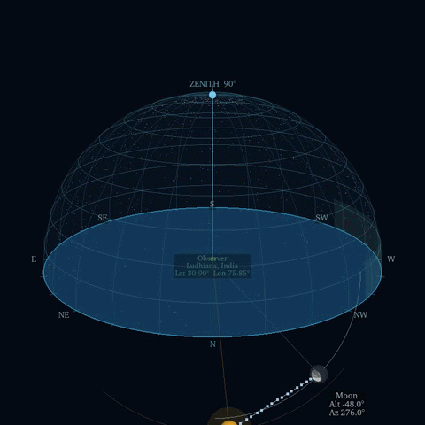
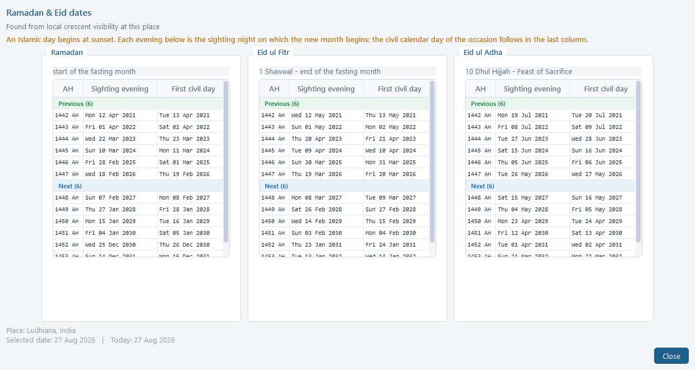
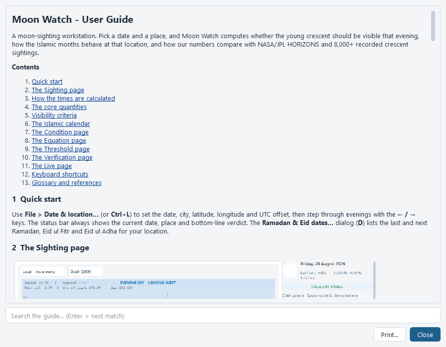
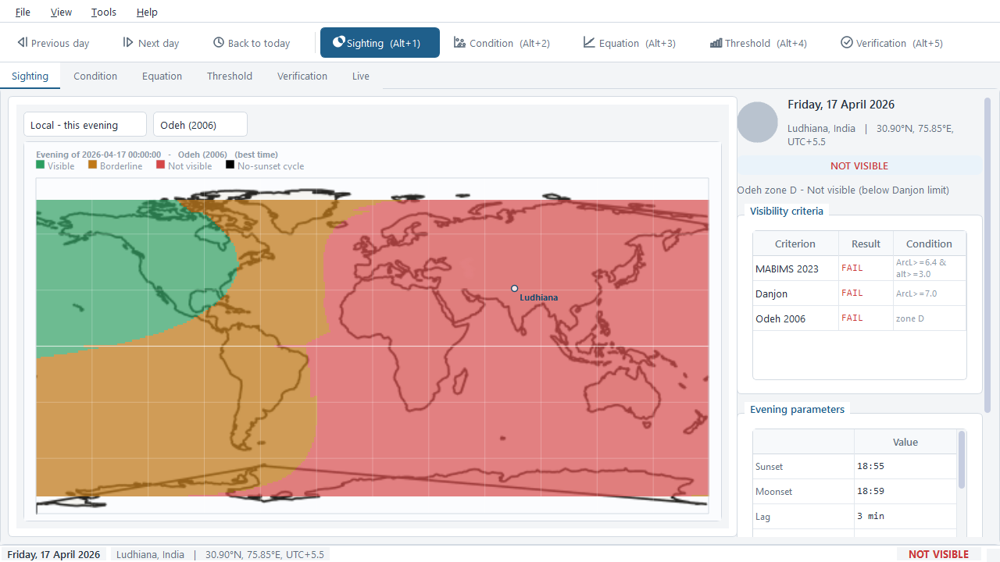

# Moon Watch — Crescent Visibility Workstation

A desktop application for predicting and analysing whether the new crescent of
Ramadan / Eid can be seen on a given evening from a given location.

This is a **PySide6 / Qt refactor** of the original pygame app: the astronomy,
analysis, calendar and verification engines are reused as-is, while the UI has
been rebuilt as a proper desktop workspace — light enterprise theme, six
tabbed views, dock-style tables and vector-rendered charts.

```
python main.py
```

Needs Python 3.11+, with `PySide6`, `PyVista` (incl. `pyvistaqt`), `numpy` and
`pandas` (install once with `pip install -r requirements.txt`). The
`solarsystem` astronomy library is vendored in `vendor/`, so no astronomy
dependency is needed. `PyVista`/`vtk` power the interactive 3D Live sky, and
`opencv-python` (`cv2`) encodes the 3D sky **MP4** export.

## Repository

* **This port** — [github.com/incredibleamir-dot/Crescent-Visibility-Workstation](https://github.com/incredibleamir-dot/Crescent-Visibility-Workstation)
* **Original pygame app** — [github.com/incredibleamir-dot/moon-watch](https://github.com/incredibleamir-dot/moon-watch)

## Workspaces

| # | View | What it does |
|---|------|--------------|
| 1 / S | Sighting | the prediction for the chosen evening: sky diagram + altitude chart + verdict panel; press **G** for a world crescent-visibility map |
| 2 / C | Condition | crescent altitude vs arc of light over the recorded sighting database |
| 3 / E | Equation | lag time vs arc of light against the visibility boundary curve |
| 4 / H | Threshold | box-and-whisker of minimum observed values for one parameter (cycle with X) |
| 5 / V | Verify | check our math against NASA/JPL HORIZONS and against real recorded sightings |
| 6 / L | Live | an interactive 3D altitude–azimuth sighting sky of the Sun and Moon right now (updates every 5 s), with a pannable 2D horizon sky map of the Sun, Moon & planets switchable from the View selector |

Every analysis chart shows a **white highlight ring** marking the evening you
have selected, and the ring follows you as you step through dates.

## Screenshots

| Sighting | Condition |
|---|---|
|  |  |

| Equation | Threshold |
|---|---|
|  |  |

| Verification | Live |
|---|---|
|  |  |

| 3D Alt–Az sighting sky (Live) |
|---|
|  |

| 2D Horizon sky map (Live) |
|---|
|  |

| 3D sky MP4 export (24 h orbit) |
|---|
|  |

| Ramadan & Eid dates | User Guide |
|---|---|
|  |  |

| Global visibility map |
|---|
|  |

A detailed, in-app **User Guide** (Help ▸ Moon Watch User Guide, Ctrl+F1)
explains how to read every chart, how sunset / moonset, moon age,
illumination and crescent width are computed, and the maths behind the
MABIMS 2023 / Danjon / Odeh (2006) criteria.

## Controls

| Key | Action |
|-----|--------|
| Left / Right | previous / next day |
| T | jump to today |
| 1–6 or S / C / E / H / V / L | switch workspace |
| R | (re)run the NASA HORIZONS comparison |
| X | cycle the Threshold-analysis parameter |
| G | toggle the Sighting map (local sky / global visibility map) |
| D | Ramadan & Eid dates dialog |
| Ctrl+L | date & location dialog |
| Ctrl+F1 | User Guide |
| F1 | About |
| F11 | toggle fullscreen |
| Ctrl+Q | quit |

## Verdict panel (Sighting view)

- **CRESCENT VISIBLE** / **BORDERLINE** / **NOT VISIBLE** banner (amber
  border-line cases, red for not visible; **NO SUNSET** when the Sun never
  sets that day).
- Evening parameters: sunset / moonset, lag, best viewing time, moon age
  (days + hours), illumination, arc of light, moon altitude, arc of vision,
  crescent width.
- Criteria check with per-rule pass/fail:
  - **MABIMS 2023** — arc of light ≥ 6.4° and moon altitude ≥ 3.0°.
  - **Danjon** — arc of light ≥ 7.0° (thin-crescent visibility limit).
  - **Odeh 2006** — zone A (easy naked eye) … D (not visible).
- **IN PLAIN WORDS** — the same conclusion as a jargon-free sentence.

## Ramadan & Eid dates dialog

Lists the previous and next **Ramadan**, **Eid ul-Fitr** (1 Shawwal) and
**Eid ul-Adha** (10 Dhul Hijjah) for the chosen location and date, using the
app's own local-crescent-visibility rule for each new month.

The Islamic day starts at **sunset**: the "first night" of each month is the
evening when the young crescent becomes visible *after* the preceding civil
day, so each date is presented as *starts at sunset on evening E (AH) — first
civil day: E + 1*. Because the same physics drives the whole app, these dates
can legitimately differ from a fixed civil calendar.

## Verify view

- **NASA/JPL HORIZONS** — compares our sunset / moonset / moon altitude /
  azimuth / arc of light / illumination against the online ephemeris
  (**requires internet access**; press R, and press R again after changing
  the date).
- **Recorded sightings** — compares our verdict against ~8,000 real-world
  sightings bundled in `data/Final.csv`, with per-method match rates
  (naked eye / optical aid).

Both checks run in background sub-processes, so the UI stays fully
responsive while they work.

## Live view

An **interactive 3D Altitude–Azimuth Sighting Sky** of the Moon and Sun as seen
from the observer's location, rendered with PyVista and recomputed from your
clock every 5 seconds, or scrubbed through the 24 h with the slider (**NOW**
snaps back to the live instant).

The hemisphere around you is drawn in the local Alt–Az frame: compass
cardinals (N highlighted), altitude rings, an azimuth grid, the horizon rim and
a translucent earth-textured ground. The Sun is a glowing sphere; the Moon is
shown at its **true phase** — the lit crescent is shaded from the Sun's
direction, so it correctly faces and thins as the real Moon does. Observer →
Sun / Moon lines, a dashed Sun–Moon separation link, and trails the two bodies
trace over ±3 h (toggle Moon/Sun path) help read the geometry at a glance.

Screen-facing readout boxes (Sun / Moon name, Alt, Az, plus the observer's
location **name and Lat/Lon**) always face the viewer. Camera buttons (Reset,
Top, North, South, East, West) plus click-drag rotate / scroll-zoom give full
control, and the **Grid**, **Moon path**, **Sun path** and **Labels** toggles
declutter the scene. All values come from the same astronomy engine that drives
every other view, so the Live sky can never disagree with the Sighting verdict.

From **Tools ▸ Export animation (GIF)...** you can also export the 3D sky as an
**MP4** (`sky-3d-<date>.mp4`): a small preview window opens, the dome is played
through a complete 24-hour Sun/Moon cycle while the camera slowly orbits 360°,
and the window closes itself when the file is written (requires OpenCV).

### Horizon sky map (Live view)

The **View** selector above the 3D sky switches to a **2D Horizon Sky Map** — a
cylindrical *azimuth × altitude* panorama of the whole sky around you, panning
freely across the full 360° with click-drag, the mouse wheel, or the arrow and
compass buttons. It is real-time (recomputed with the same 5 s clock): the **Sun**,
**Moon** at its true phase, and the bright planets (Mercury, Venus, Mars, Jupiter,
Saturn) are drawn at their live positions with labels, each with its **day-long
altitude path** traced across the sky, plus the **ecliptic** line. The background
**transitions seamlessly from day to twilight to night** as the Sun moves, with a
warm glow resting on the horizon toward the Sun at twilight; compass directions are
marked below the horizon. As with the 3D sky, every value comes from the same
astronomy engine, so the map always agrees with the rest of the app.

### Aim the sky map from your phone (SensorCast WebSocket)

Drive the live sky by physically pointing your phone at the sky — the phone
streams its rotation-vector orientation (and optionally its GPS location) over
the **SensorCast** WebSocket service, which the desktop subscribes to:

1. On the phone install the **SensorCast** app (https://sensorcast.app), create
   an account and start broadcasting **Rotation Vector** + **Magnetic Field**
   (+ Accelerometer as backup) at the fastest delay (add a
   GPS + Network Location stream if you also want live location). Note your
   username.
2. On the desktop **LIVE** page, type the username into the *Phone link* box and
   press **Connect**. The box flips to **"streaming from \<username\>"** the
   moment the subscription is accepted.
3. With **Drive sky map from phone** ticked, stand on your spot and point the
   **top edge of the phone** at the sky (laser-pointer pose; switch to *Back
   camera* in *Point with* if you prefer the photograph pose): turning your
   body pans left/right, tilting the top up/down sweeps vertically (the view
   is clamped to 0–90° of altitude, horizon line pinned just below at -5°).
   If the view lags your hand, point the top at the Moon/Sun, drag that body
   to the middle and press **Calibrate...**.

A **GPS** frame from the phone also updates the live location (tick **Use phone
GPS location** to apply it). A quick "figure-8" wave with the phone improves the
compass calibration; the live **mag uT** readout shows field health (~25–65 uT
is clean Earth field, far outside means indoor interference). Residual twist is
what **North offset** + **Calibrate...** correct for.

The two connections use the same wire format — Socket.IO namespace
`/stream/<username>`, `role=subscriber` + heartbeat — whose parsing/aim math
(`moonwatch/sensorcast.py`) is shared with the terminal capture tool
`tools/sensorcast_capture.py`.

**No phone handy?** `tools/phone_sim.py` remains as a *legacy* UDP simulator:
it is kept for offline reference, but the desktop link now listens over
WebSocket, so it is not wired to the current receiver.

## Global visibility map (Sighting view, key G)

Switch the Sighting map to **Global** to see, for the same evening, which
places on Earth could sight the crescent: every 1° cell is evaluated at that
place's *best time* — the same rules that drive the verdict pill below (Odeh
2006 zones at sunset + 4/9 of the moonset lag, MABIMS 2023 and Danjon at
their sunset/best instants) — then classified green (visible) / amber
(borderline) / red (not visible), with the no-sunset polar band left clear.
The two views therefore never disagree. The 1° grid (≈64k points) is computed
in a background sub-process once per date and cached in memory, so stepping
back and forth between dates is instant; your city is pinned on the map.

## Project layout

```
main.py                 entry point
tools/sensorcast_capture.py   terminal SensorCast WebSocket capture tool
tools/phone_sim.py      legacy UDP desktop phone simulator (reference only)
moonwatch/
  theme.py              palette, stylesheet, fonts
  controller.py         shared state + computation threads
  charts.py             vector canvas widgets (sky, altitude, scatter, box)
  sighting_sky_3d.py    interactive 3D Alt–Az sighting sky (PyVista)
  sky_map.py            2D pannable horizon sky map (Live view)
  sensorcast.py         SensorCast wire protocol parsing + aim math (shared)
  phone.py              SensorCast WebSocket phone-link receiver
  pages.py              the six workspace pages
  dialogs.py            date & location, Ramadan/Eid dates, About
  app_window.py         main window, menus, toolbar, shortcuts
astronomy.py            core ephemeris engine (reused, unchanged)
analysis.py             analysis engines (reused, unchanged)
islamic.py              Islamic calendar (reused, unchanged)
verification.py         HORIZONS + sightings checks (reused, unchanged)
vendor/solarsystem/     vendored astronomy library (unchanged)
data/Final.csv          recorded-sightings database
assets/                 Sun / Earth / Moon texture maps
```

See `PYGAME_TO_PYSIDE6.md` for the port mapping and `CREDITS.md` for
attribution.