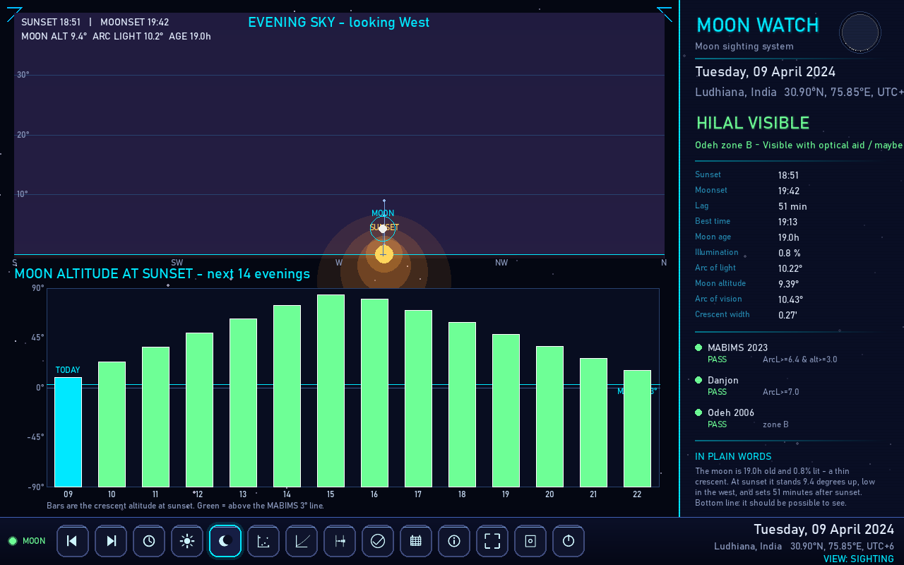
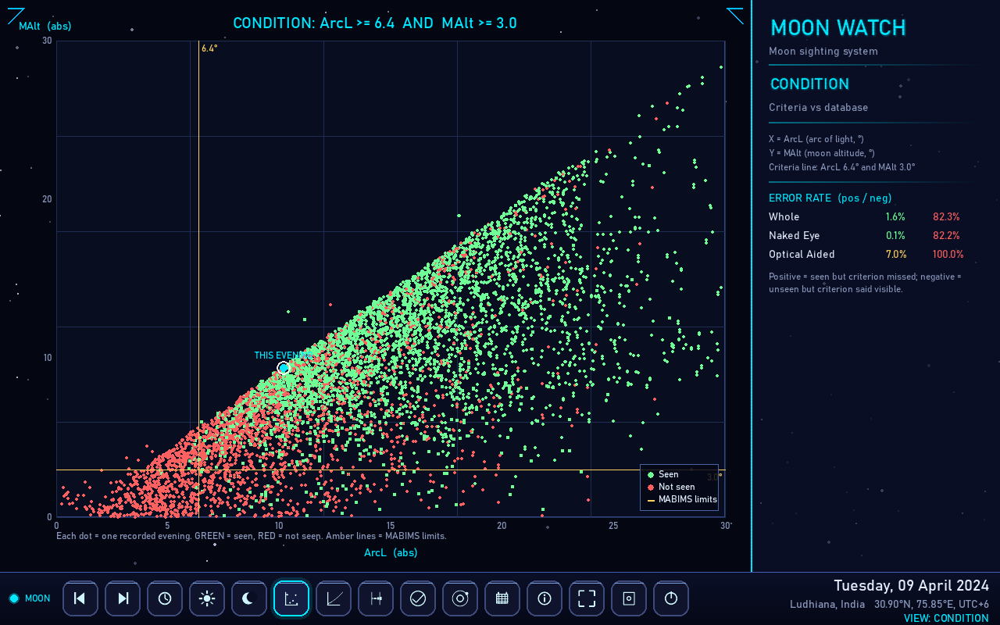
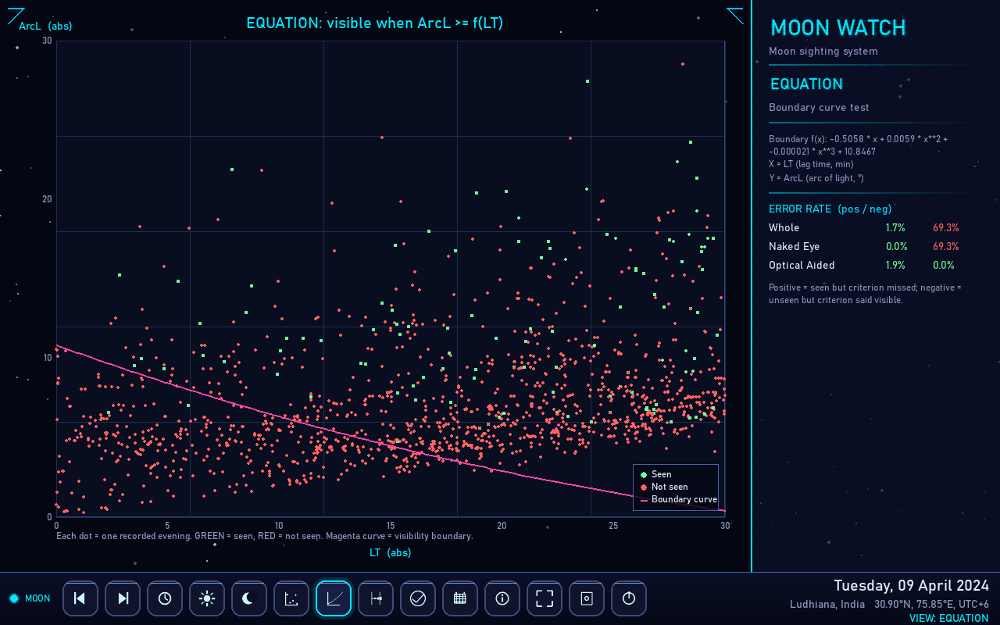
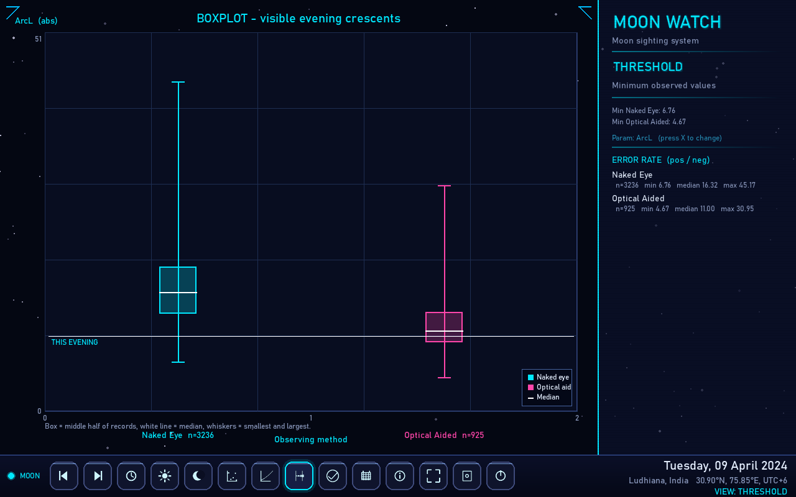
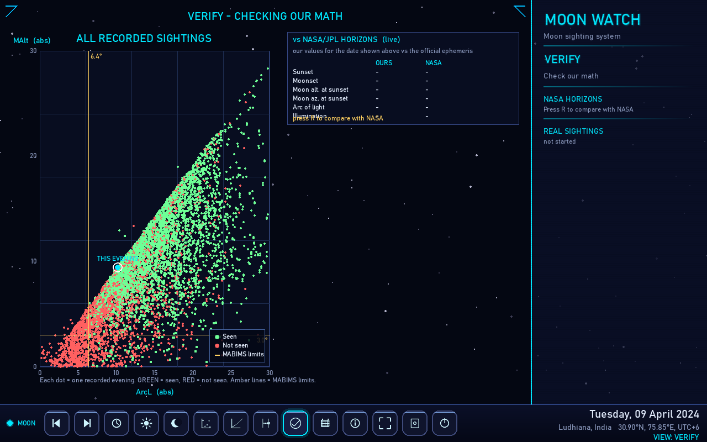
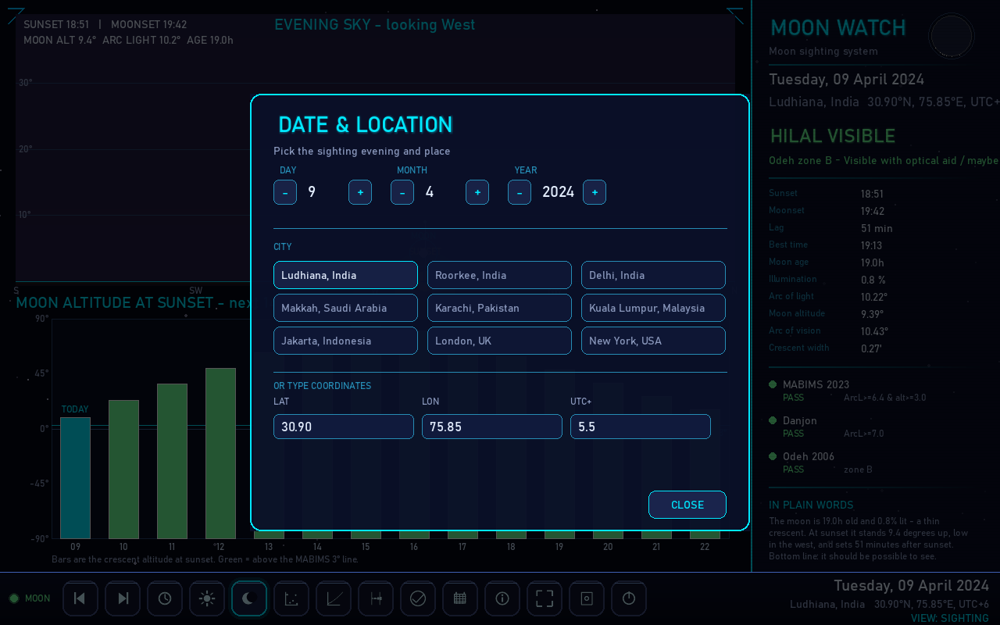
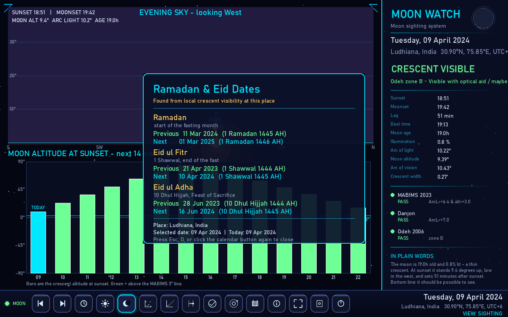
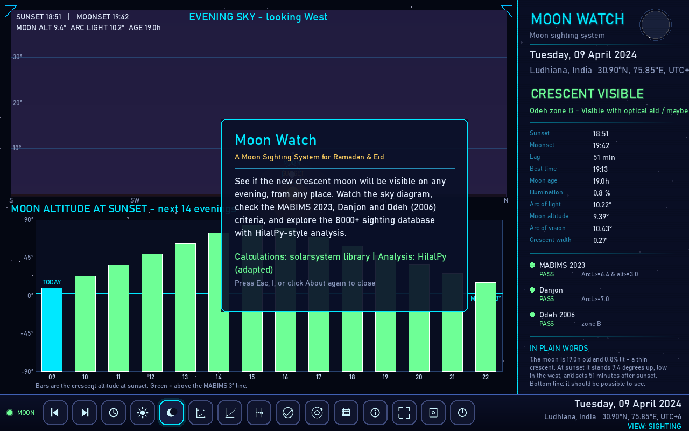

# Moon Watch - Ramadan / Eid new-crescent viewer

A pygame desktop app for predicting whether the new (hilal) crescent of Ramadan /
Eid can be seen on a given evening from a given location. The look matches the
neon HUD style of the parent [`tiny-solarsystem`](https://github.com/incredibleamir-dot/tiny-solarsystem)
project: dark futuristic panels, glowing borders, scanlines and a taskbar.

```
python hilal_sighting.py
```

Needs `pygame`, `numpy` and `pandas` (install once with `pip install -r
requirements.txt`). The `solarsystem` astronomy library is vendored in the
`vendor/` folder, so no astronomy dependency is needed. See *Download & run*
below.

## Features

* **Sighting view** - an "evening sky, looking West" diagram with the Sun
  half-sunk at the horizon at sunset, a warm sunset glow at the Sun's azimuth,
  the young crescent (true illuminated fraction & bright-limb orientation), a
  dotted altitude trail for the Moon over the evening, a drop-line from the Moon
  to the horizon, a 14-evening altitude-at-sunset bar chart, and a visibility
  verdict panel (sunset / moonset, lag, moon age in **days + hours**,
  illumination, arc of light, arc of vision, crescent width).
* **Analysis views** - faithful adaptations of the HilalPy `cond`, `equa` and
  `thres` analyses rendered as charts:
  * `cond`  - conditions: crescent altitude vs arc of light with the MABIMS line
  * `equa`  - equation: daily error / comparison plot
  * `thres` - threshold: line fit vs data for a chosen parameter (ArcL / MAlt /
    Relative Azimuth / Lag / Age), cycled with the **X** key
* **Visibility criteria** - MABIMS 2023, Danjon limit and Odeh (2006) zones A-D,
  all shown in the panel with pass/fail indicators.
* **Plain-language summary** - every evening gets a jargon-free reading ("the
  moon is 19 hours old and 0.8% lit - a thin crescent..."), so non-technical
  users can read the result without the astronomy.
* **Analysis charts with labels** - the `cond` / `equa` / `thres` plots now have
  axis titles, legends, captions and a white ring marking **THIS EVENING**, and
  the ring moves as you step through dates.
* **Verify view** - an independent check of our math:
  * a live comparison of our sunset / moonset / altitude / arc of light /
    illumination against the **NASA/JPL HORIZONS** ephemeris (works for past
    and future dates, press **R** to run or re-run, **R** again after changing
    the date);
  * an offline comparison of our visibility verdict against **8,000 recorded
    real-world sightings**, with per-method match rates.
* **Ramadan & Eid dates** - a dialog (calendar button on the taskbar, or **D**)
  that works out the previous and next **Ramadan**, **Eid ul-Fitr** and
  **Eid ul-Adha** for the chosen location and date, using the app's own
  local-crescent-visibility rule for each new month.

## Screenshots

















## Download & run

```
pip install -r requirements.txt
python hilal_sighting.py
```

* The app uses `pygame` (UI) and `numpy` / `pandas` (analysis charts) from PyPI
  - they are **not** bundled, so a one-time `pip install -r requirements.txt`
  is needed.
* The `solarsystem` astronomy library is vendored in the repo's
  `vendor/solarsystem/` folder (also used by the parent
  [`tiny-solarsystem`](https://github.com/incredibleamir-dot/tiny-solarsystem)
  app) - it has no external dependencies, so nothing extra is needed for it.

## Controls

| Key        | Action                         |
|------------|--------------------------------|
| Left/Right | previous / next day            |
| T          | jump to today                  |
| 1-4        | switch views                   |
| 5 or V     | switch to the Verify view      |
| R          | (re)run the NASA HORIZONS check|
| X          | cycle threshold parameter      |
| D          | show/hide Ramadan & Eid dates  |
| I          | show/hide About                |
| F11        | toggle fullscreen              |
| Esc        | close modal / exit fullscreen  |
| **Quit**   | use the power button on the taskbar to exit |

Esc never quits the program - use the taskbar power button instead.

## Setup

Use the **Setup** button (the gear on the taskbar at the bottom) to change the
date with the steppers and to pick a location:

* 9 city presets (**Ludhiana**, **Roorkee**, Delhi, Makkah, Karachi, Kuala
  Lumpur, Jakarta, London, New York), or
* custom latitude / longitude / UTC offset fields (type a value and press
  **Enter** / **Tab**).

## How to use the app

1. **Start it** from the repo folder:
   ```
   python hilal_sighting.py
   ```
2. **Pick your place and evening** - open **Setup** (the gear button on the
   taskbar at the bottom). Choose a city preset or type a custom latitude /
   longitude / UTC offset, then step to the date you want (the **+**/**-**
   steppers, or the **Left** / **Right** keys; **T** jumps to today).
3. **Switch views** with the taskbar buttons or the number keys:

   | # | View | What it does |
   |---|------|--------------|
   | 1 | Sighting | the prediction for the chosen evening (sky diagram + verdict panel) |
   | 2 | Condition | crescent altitude vs arc of light over the 8,000+ sighting database |
   | 3 | Equation | lag time vs arc of light against the visibility boundary curve |
   | 4 | Threshold | the minimum observed values for one parameter (cycle with **X**) |
   | 5 / V | Verify | check our math against NASA/JPL HORIZONS and real sightings |

4. **Step through evenings** - use **Left** / **Right** to move day by day. The
   white ring on the analysis charts follows the evening you select, so you can
   see the crescent's position move across the historical data.
5. **Quit** with the power button on the taskbar (Esc only closes pop-ups and
   never quits the program).

## How to read the data

### Sighting view (1)

**Left - the sky diagram** ("EVENING SKY - looking West"):

* The horizon line with compass labels **S / SW / W / NW / N**; the curved
  rings are altitude marks every **10°**.
* The **Sun** is drawn half-sunk at the horizon at sunset, with a warm glow
  marking its azimuth.
* The **Moon** (cyan ring) is drawn at its true position; the crescent shape
  shows the real illuminated fraction and bright-limb orientation. The **dotted
  trail** traces the Moon's path over the evening, and the **drop-line** from the
  Moon to the horizon shows how high it is.
* The info strip under the title gives **SUNSET / MOONSET** times, **MOON ALT**,
  **ARC LIGHT** and the moon **AGE**.

**Left - the 14-evening chart** - the Moon's altitude at sunset for the next
14 evenings. This is the practical one: it shows you the first evening the
crescent clears the horizon and becomes worth looking for.

**Right - the verdict panel**:

* The big banner: **HILAL VISIBLE** (green), **BORDERLINE** (amber) or
  **NOT VISIBLE** (red); **NO SUNSET** if the Sun doesn't set that day.
* The numbers table, read from top to bottom:
  * **Sunset / Moonset** - local clock times.
  * **Lag** - how many minutes after sunset the Moon sets ("above horizon all
    evening" or "moon already set" when the Moon doesn't set normally).
  * **Best time** - the recommended moment to look.
  * **Moon age** - since the last new moon, shown as **days + hours**
    (e.g. `1d 19h`).
  * **Illumination** - how much of the Moon's disk is lit (%).
  * **Arc of light** - the Moon's angular separation from the Sun in degrees.
  * **Moon altitude** - how high the Moon is at sunset, in degrees.
  * **Arc of vision** - the Moon's angular separation from the Sun measured
    along the Moon's orbital path.
  * **Crescent width** - the width of the lit crescent in arc-minutes.
* The **criteria check** (green = pass, red = fail):
  * **MABIMS 2023** - needs arc of light >= 6.4° and moon altitude >= 3.0°.
  * **Danjon** - needs arc of light >= 7.0° (the thin-crescent visibility limit).
  * **Odeh 2006** - a zone A-D from arc of vision, width and elongation:
    * **A** - easily visible to the naked eye
    * **B** - visible with optical aid / maybe naked eye
    * **C** - visible with optical aid only
    * **D** - not visible
* The verdict combines these: zone A or B -> **HILAL VISIBLE**; zone C or a
  MABIMS/Danjon pass -> **BORDERLINE**; otherwise **NOT VISIBLE**.
* **IN PLAIN WORDS** - the same conclusion written as a normal sentence
  ("The moon is 19h old and 0.8% lit - a thin crescent..."), for when you don't
  want the numbers.

### Analysis views (2-4)

These compare the chosen evening against **8,000+ real recorded sightings**
(GREEN dot = the crescent was seen, RED = it was not):

* **Condition (2)** - X = arc of light, Y = moon altitude. The amber lines are
  the MABIMS limits; if your evening (white ring) falls above and to the right
  of them, similar conditions were seen before.
* **Equation (3)** - X = lag time (minutes), Y = arc of light. The magenta
  curve is the visibility boundary from the data: evenings above the curve were
  seen, evenings below were not.
* **Threshold (4)** - box-and-whisker plot of the minimum observed value for one
  parameter (**ArcL**, **MAlt**, **ArcV**, **W**, **LT**, **MA** - cycle with
  **X**). The box holds the middle half of seen records, the white line is the
  median, and the whiskers are the smallest and largest. The white line plus
  label marks where **THIS EVENING** falls.

### Verify view (5 / V)

* **Left** - the same "all recorded sightings" scatter with **THIS EVENING**
  ringed.
* **Right** - a live comparison of our **Sunset / Moonset / Moon alt. / Moon
  az. / Arc of light / Illumination** against the **NASA/JPL HORIZONS**
  ephemeris. Press **R** to run it; each row shows OUR value, NASA's value and a
  **PASS / FAIL** verdict, with a status line ("contacting NASA...",
  "all within tolerance", etc.). If you change the date, press **R** again.
* Below that, the **real-sightings** box shows how often our verdict matched the
  recorded sightings, overall and per method (naked eye / optical aid).

### Ramadan & Eid dates dialog (calendar button / D)

Opens a modal that lists the **previous and next** dates for **Ramadan**,
**Eid ul-Fitr** (1 Shawwal) and **Eid ul-Adha** (10 Dhul Hijjah) for the chosen
location and date. The month starts are found from the new-moon (conjunction)
dates plus the app's own local rule: each month begins the day after the first
evening on which the young crescent is actually above the horizon at sunset at
your place, and the year is anchored to a well-known reference (1 Ramadan 1446 AH
= 1 March 2025). Because it uses the same physics as the rest of the app, the
dates can legitimately differ from a fixed civil calendar.

## Physics

The orbital model is Paul Schlyter's ("How to compute planetary positions"),
vendored as the `solarsystem` package in this repo's `vendor/` folder - no extra
astronomy dependency. Sunsets / moonsets are solved by iterating the apparent
altitude through the atmospheric refraction horizon.

Crescent width follows Odeh (2006); the bright-limb position angle drives the
crescent orientation in the sky diagram.

## HilalPy dataset

`cond` / `equa` / `thres` use the HilalPy `Final.csv` observation database
(8,004 night-sighting records). The upstream library downloaded this file from a
GitHub URL that no longer exists, so a copy (pulled from the historical commit)
is bundled at `data/Final.csv`.

## Tests

```
python -m pytest tests
```

Runs headless (no window needed). The suite covers the astronomy against known,
independently-verified values, the analysis chart builders, the app layout and
input handling, and the verification module - including a **live** check of both
a past (Ludhiana 2024-04-09) and a future (Mecca 2026-08-20) date against the
NASA/JPL HORIZONS ephemeris. The online tests skip automatically when offline.

## Requirements

Install once with pip (a `requirements.txt` at the repo root lists them):

```
pip install -r requirements.txt
```

* `pygame` - UI
* `numpy`, `pandas` - analysis charts

The `solarsystem` astronomy library is vendored at `vendor/solarsystem/` and has
no external dependencies, so no astronomy package needs to be installed.
